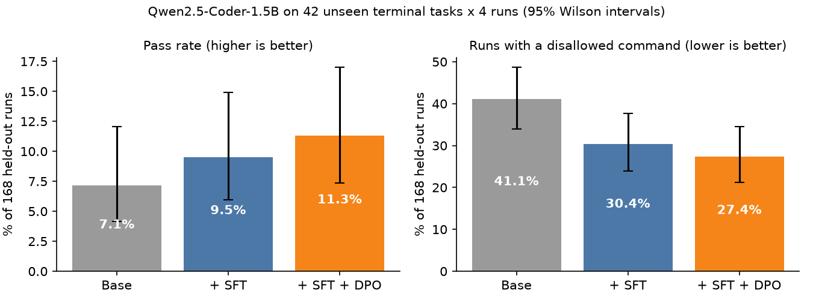

<p align="left">
  <small><code>RESEARCH &middot; PREFERENCE LEARNING &middot; AGENTIC SYSTEMS</code></small>
</p>

<h1>Agent<em>Align</em><br>Lab</h1>

<p>
  A pipeline for verifier-guided preference learning in terminal agents.<br>
  No human raters. Structured feedback at scale.
</p>

<hr>

#### <small><code>MOTIVATION</code></small>

Current RLHF pipelines depend on human preference labels — expensive, inconsistent, and hard to scale for agentic settings. AgentAlign Lab replaces human raters with deterministic verifiers wherever the task has an unambiguous correct answer: code execution, arithmetic, structured retrieval. The feedback loop closes automatically.

<hr>

#### <small><code>PIPELINE</code></small>

<table>
  <tr>
    <td valign="top"><code>01</code></td>
    <td valign="top"><strong>Task Generation</strong><br>Synthetic task datasets across verifiable domains — code, math, structured data retrieval.</td>
  </tr>
  <tr>
    <td valign="top"><code>02</code></td>
    <td valign="top"><strong>ReAct Agent Loop</strong><br>Agent observes, reasons, and acts across tool calls. Full trajectory is recorded.</td>
  </tr>
  <tr>
    <td valign="top"><code>03</code></td>
    <td valign="top"><strong>Deterministic Verifier</strong><br>Pure functions. Input: trajectory. Output: scalar score. No learned reward model.</td>
  </tr>
  <tr>
    <td valign="top"><code>04</code></td>
    <td valign="top"><strong>DPO Preference Pairs</strong><br>Scored trajectories are paired — chosen vs rejected — for direct preference optimization.</td>
  </tr>
  <tr>
    <td valign="top"><code>05</code></td>
    <td valign="top"><strong>QLoRA Fine-Tuning</strong><br>TRL-based training on Apple Silicon or free-tier GPU. No dedicated compute required.</td>
  </tr>
  <tr>
    <td valign="top"><code>06</code></td>
    <td valign="top"><strong>Evaluation + Dashboard</strong><br>Evaluation harness and Gradio dashboard for inspecting trajectories and training outcomes.</td>
  </tr>
</table>

<hr>

#### <small><code>RESULTS</code></small>

**Fine-tuning on verifier-checked rollouts raised the pass rate from 7.1% to 11.3% and cut runs with a disallowed command from 41.1% to 27.4%** on 42 unseen terminal tasks (4 runs each, 168 runs per model, `Qwen2.5-Coder-1.5B-Instruct`, QLoRA on one free Kaggle T4).



| Model | Pass rate | Runs with a disallowed command | Invalid actions / step | Avg steps |
|:---|:---:|:---:|:---:|:---:|
| **Base** | 7.1% (12/168) | 41.1% | 0.331 | 5.72 |
| **+ SFT** on successful steps | 9.5% (16/168) | 30.4% | 0.179 | 3.99 |
| **+ SFT + DPO** on verifier-labelled steps | **11.3% (19/168)** | **27.4%** | **0.130** | 3.89 |

Paired per-task bootstrap, 10,000 resamples:

| Comparison | Pass-rate change | 95% CI | p | Disallowed-run change | 95% CI |
|:---|:---:|:---:|:---:|:---:|:---:|
| SFT + DPO vs base | **+4.2 pts** | [+1.2, +7.7] | 0.010 | **-13.7 pts** | [-24.4, -3.0] |
| SFT vs base | +2.4 pts | [+0.6, +4.8] | 0.030 | -10.7 pts | [-20.2, -1.8] |
| SFT + DPO vs SFT | +1.8 pts | [-1.8, +5.9] | 0.363 | -3.0 pts | [-11.9, +5.9] |

How to read it honestly:
- SFT + DPO vs base survives a Holm correction for the three comparisons (adjusted p = 0.03); SFT vs base is borderline (0.06).
- DPO on top of SFT points the right way on every metric but is **not significant on its own**.
- The pass-rate gain is concentrated in Python bug-fixing (3/60 → 10/60). Other families barely moved; the drop in disallowed commands is broad.
- Small scale: 89 SFT examples, 107 DPO pairs, 42 test tasks, one training seed. The per-model bars above overlap; the significance comes from the paired per-task comparison.

Full numbers: [`v2/results/eval_results.json`](v2/results/eval_results.json) · per-family table and method: [`report/paper.md`](report/paper.md)

<hr>

#### <small><code>HOW V2 FIXED A NULL RESULT</code></small>

v1 trained DPO on 80 pairs and found nothing (8.4% vs 7.7%, CI spanning zero). Two causes:

1. **The training input did not match what the agent sees.** v1's prompt was `"Task: config_repair_001"` and its completion was the whole trajectory, environment output included. At inference the agent gets the full system prompt, step history and chat template, and writes one JSON action. v2 logs the exact prompt and raw output of every step and trains on those, token for token.
2. **Almost no successes to learn from.** Only 11 of v1's 80 "chosen" trajectories had succeeded. v2 samples 16 runs per train task with a batched engine on two GPUs (1,296 rollouts), keeps 100 clean steps from successful runs, and builds step-level pairs: at the same state, the action that led to success vs an alternative a deterministic check proves bad.

| Rejected because | Pairs |
|:---|:---:|
| invalid JSON | 82 |
| disallowed command | 19 |
| unknown action | 11 |
| `final_answer` while the verifier still fails | 7 |
| path outside the workspace | 2 |

<hr>

#### <small><code>REPRODUCE</code></small>

v2 runs end to end on Kaggle (GPU T4 x2, about 3 h): see [`kaggle/v2/README.md`](kaggle/v2/README.md). The stages are also a CLI:
```bash
python scripts/v2_pipeline.py rollout --split train --samples 16 --agent-id qwen_base_sample --out v2/rollouts_train --temperature 0.9 --top-p 0.95
python scripts/v2_pipeline.py states  --rollouts v2/rollouts_train --out v2/data/states.jsonl
python scripts/v2_pipeline.py alts    --states v2/data/states.jsonl --k 4 --out v2/alts
python scripts/v2_pipeline.py build   --states v2/data/states.jsonl --alts v2/alts --out-dir v2/data --max-dpo-pairs 1200
python scripts/v2_pipeline.py train   --kind sft --model Qwen/Qwen2.5-Coder-1.5B-Instruct --train v2/data/sft_train.jsonl --eval v2/data/sft_eval.jsonl --config v2/data/sft_config.json --out v2/adapters/sft
python scripts/v2_pipeline.py merge   --base Qwen/Qwen2.5-Coder-1.5B-Instruct --adapter v2/adapters/sft --out v2/models/sft_merged
python scripts/v2_pipeline.py train   --kind dpo --model v2/models/sft_merged --train v2/data/dpo_train.jsonl --eval v2/data/dpo_eval.jsonl --config v2/data/dpo_config.json --out v2/adapters/dpo
python scripts/v2_pipeline.py rollout --split test --samples 4 --agent-id qwen_sft_dpo --model v2/models/sft_merged --adapter v2/adapters/dpo --out v2/eval/qwen_sft_dpo
python scripts/v2_pipeline.py report  --eval-dir v2/eval --out v2/results/eval_results.json
```

The v1 scripts (`scripts/01`–`14`) are kept for reference.

<hr>

#### <small><code>DESIGN DECISIONS</code></small>

<table>
  <tr>
    <td valign="top" width="50%">
      <small><code>WHY DPO, NOT PPO?</code></small><br><br>
      <strong>Stability.</strong> DPO avoids the instability and hyperparameter sensitivity of online RL — a natural fit for synthetic pair construction.
    </td>
    <td valign="top" width="50%">
      <small><code>WHY DETERMINISTIC VERIFIERS?</code></small><br><br>
      <strong>Interpretability.</strong> Rule-based scorers are more reliable and cheaper than a learned reward model for tasks with ground truth.
    </td>
  </tr>
  <tr>
    <td valign="top" width="50%">
      <small><code>WHY QLORA?</code></small><br><br>
      <strong>Accessibility.</strong> Runs on M-series chips and Colab free tier. The entire loop — generation to fine-tune — needs no paid GPU.
    </td>
    <td valign="top" width="50%">
      <small><code>WHY MODULAR STAGES?</code></small><br><br>
      <strong>Inspectability.</strong> Stages write to disk in defined schemas. Swap any component; resume interrupted runs cleanly.
    </td>
  </tr>
</table>

<hr>

#### <small><code>STRUCTURE</code></small>

```text
AgentAlign-Lab/
  tasks/       - task generators and dataset schemas
  agent/       - ReAct loop implementation
  verifiers/   - deterministic verifier suite
  preference/  - DPO pair construction
  training/    - QLoRA fine-tuning via TRL
  eval/        - evaluation harness
  dashboard/   - Gradio interface
  v2/          - (src/agentalign/v2) batched rollouts, step-level pairs, SFT + DPO, metrics
  kaggle/v2/   - Kaggle notebook and bundle builder for the v2 run
  v2/results/  - evaluation results, figures, data summaries, training logs
  configs/     - experiment configs (YAML)
  scripts/     - v1 stage scripts and scripts/v2_pipeline.py
```

<hr>

#### <small><code>STATUS</code></small>

<p>
  <code>task generation - done</code>&nbsp;
  <code>react loop - done</code>&nbsp;
  <code>verifiers - done</code>&nbsp;
  <code>dpo pairs - done</code><br><br>
  <code>llm rollouts - done</code>&nbsp;
  <code>fine-tuning - done</code>&nbsp;
  <code>eval - done</code><br><br>
  <code>v1 - null result, diagnosed</code>&nbsp;
  <code>v2 - +4.2 pts pass rate, -13.7 pts unsafe runs</code>
</p>

<hr>

#### <small><code>RESEARCH QUESTION</code></small>

> *To what extent can verifier-guided feedback — without any human annotation — produce agents that generalise across task types rather than overfit to the verifier's scoring function?*

Next: a second sampling round from the SFT + DPO model, several training seeds, and a larger zero-shot model as a reference point.

<hr>

<p>
  Shiv &middot; VIT-AP University, B.Tech CS (AI/ML) &middot; Batch 2027<br>
  <a href="https://hey-shiv.github.io">hey-shiv.github.io</a> &middot; <a href="https://x.com/NaadhLabs">@NaadhLabs</a>
</p>
